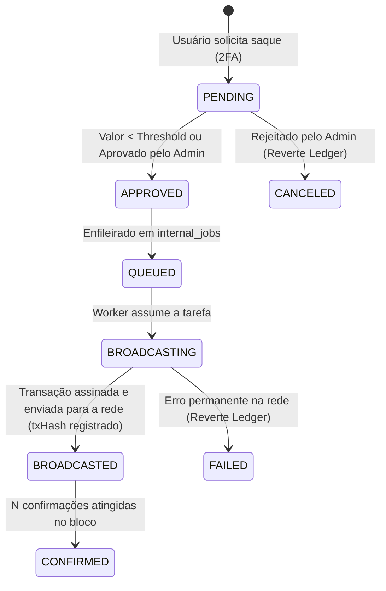

# Integração com Blockchain e Clientes On-Chain

A crate `chain` (`crates/chain/`) é responsável por toda a comunicação com redes blockchain públicas, derivação determinística de endereços de depósito, consulta de saldos e UTXOs, estimativa de taxas e montagem/assinatura offline de transações de saque.

---

## 1. Moedas Suportadas e Redes

| Moeda | Símbolo | Tipo de Rede | Padrão de Endereço | Provedor / RPC |
|---|---|---|---|---|
| **Bitcoin** | `BTC` | UTXO | Bech32 (P2WPKH / SegWit Nativo) `bc1q...` / `tb1q...` | Bitcore Insight API / Nó Próprio |
| **Litecoin** | `LTC` | UTXO | Bech32 (P2WPKH) `ltc1q...` / `tltc1q...` | Bitcore Insight API / Nó Próprio |
| **Dogecoin** | `DOGE` | UTXO | Base58Check (P2PKH) `D...` / `n...` | Bitcore Insight API / Nó Próprio |
| **Bitcoin Cash** | `BCH` | UTXO (ForkId) | CashAddr `q...` / `bchtest:...` | Bitcore Insight API / Nó Próprio |
| **Polygon (POL)** | `POL` | EVM (Account) | Hexadecimal EIP-55 `0x...` | JSON-RPC Polygon (ChainId 137 / 80002) |

---

## 2. Derivação Determinística de Endereços (HD Wallet)

O sistema utiliza derivação hierárquica determinística (**BIP32**) a partir de uma **chave pública estendida (`xpub`)** mestra por moeda (ou compartilhada entre moedas secp256k1):

```text
xpub Mestra (Somente Leitura no api-server)
      │
      ├── BTC  Seq: btc_hd_index_seq  ──> m/0/1 -> m/0/2 -> m/0/N
      ├── LTC  Seq: ltc_hd_index_seq  ──> m/0/1 -> m/0/2 -> m/0/N
      ├── DOGE Seq: doge_hd_index_seq ──> m/0/1 -> m/0/2 -> m/0/N
      ├── BCH  Seq: bch_hd_index_seq  ──> m/0/1 -> m/0/2 -> m/0/N
      └── POL  Seq: pol_hd_index_seq  ──> m/0/1 -> m/0/2 -> m/0/N
```

### 2.1 Por que Sequência Postgres em vez de Hash de User ID?
Conforme o [ADR 0008](file:///home/gustavo/Documentos/BitcoSats/current/docs/decisions/0008-real-chain-clients.md), a derivação usa sequências atômicas do PostgreSQL (`*_hd_index_seq`). Isso garante:
1. Índices estritamente sequenciais e sem colisões.
2. Conformidade com os padrões de derivação de carteiras HD da indústria.
3. Segurança: o servidor web (`api-server`) possui apenas a chave pública (`xpub`), sendo incapaz de assinar ou mover fundos.

---

## 3. Máquina de Estados do Saque e Assinatura



### 3.1 Assinatura Segura por Moeda
- **BTC, LTC, DOGE**: Assinatura P2WPKH usando curvas secp256k1.
- **BCH**: Assinatura P2PKH com algoritmo de digest BIP143 e flag obrigatória `SIGHASH_FORKID` (0x41).
- **POL**: Transação EVM assinada no padrão EIP-155 com RLP encoding, consultando nonce e gas price em tempo real via JSON-RPC.

---

## 4. Modos de Operação: Stub vs Real

Controlado pelas variáveis de ambiente:
- `USE_REAL_CHAIN_CLIENTS=true`: Ativa comunicação real com nós de blockchain.
- `ALLOW_STUB_CHAIN=false`: Bloqueia o uso de geradores falsos de endereço em produção (fail-closed).
- `CHAIN_NETWORK`: Define se a rede alvo é `mainnet` ou `testnet`.
