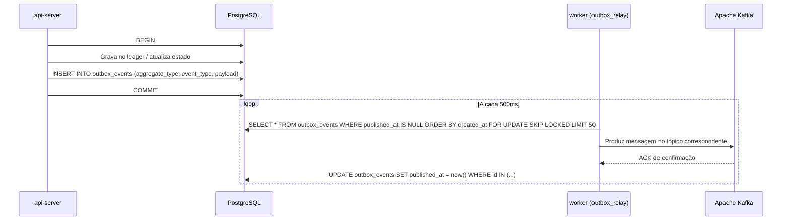

# Eventos de Domínio e Processamento em Segundo Plano

Este documento detalha o sistema de streaming de eventos via **Apache Kafka**, o padrão **Transactional Outbox** e a fila interna de processamento de tarefas baseada em **PostgreSQL**.

---

## 1. Padrão Transactional Outbox

No BitcoSats, nenhuma ação do usuário publica diretamente no broker do Kafka para evitar inconsistências de *dual-write* (onde a escrita no banco de dados falha, mas a mensagem foi enviada, ou vice-versa).



### 1.1 Tabela `outbox_events`

```sql
create table outbox_events (
    id uuid primary key default gen_random_uuid(),
    aggregate_type text not null,        -- Ex: 'wallet', 'user', 'admin'
    aggregate_id uuid not null,          -- ID do recurso afetado
    event_type text not null,            -- Ex: 'DepositConfirmed', 'WithdrawalCreated'
    payload jsonb not null,              -- Detalhes estruturados do evento
    created_at timestamptz not null default now(),
    published_at timestamptz,            -- Nulo enquanto pendente
    attempts int not null default 0
);
```

---

## 2. Eventos de Domínio e Tópicos Kafka

Os eventos são publicados em tópicos segregados por contexto de domínio (*bounded context*):

| Tópico | Eventos Principais | Descrição |
|---|---|---|
| `bitcosats-wallet-events` | `DepositConfirmed`, `WithdrawalCreated`, `WithdrawalBroadcasted`, `WithdrawalConfirmed`, `TransferExecuted` | Eventos de movimentação financeira |
| `bitcosats-auth-events` | `UserRegistered`, `UserLoggedIn`, `TwoFactorToggled`, `ApiKeyIssued` | Eventos de identidade e autenticação |
| `bitcosats-swap-events` | `SwapExecuted` | Execuções de conversão entre pares |
| `bitcosats-faucet-events` | `FaucetClaimed`, `FaucetSiteCreated` | Operações do faucet |
| `bitcosats-stake-events` | `StakeCreated`, `StakeClaimed`, `StakeCanceled` | Eventos do módulo de rendimento |
| `bitcosats-lend-events` | `LendSupplied`, `LendWithdrawn`, `LendBorrowed`, `LendRepaid`, `LendLiquidated` | Mercado de empréstimos |
| `bitcosats-admin-events` | `WithdrawalApproved`, `WithdrawalRejected`, `HouseFunded` | Ações administrativas |

---

## 3. Fila Interna de Jobs (`crates/queue`)

Para tarefas agendadas e assíncronas internas da plataforma (ex: broadcast de transação de saque, retentativas de envio), a plataforma utiliza uma tabela PostgreSQL dedicada com `SELECT ... FOR UPDATE SKIP LOCKED`, eliminando a necessidade de gerenciadores externos como Redis/BullMQ.

### 3.1 Vantagens da Abordagem Postgres
- **Atomicidade**: A criação do job ocorre na mesma transação que alterou o estado do saque.
- **Resiliência a Falhas**: Caso o nó worker caia durante a execução do job, o lock de linha é liberado e outro worker pode reassumir.
- **Sem Dual-State**: Uma única fonte de verdade para o estado da aplicação e da fila.

### 3.2 Tabela `internal_jobs`

```sql
create table internal_jobs (
    id uuid primary key default gen_random_uuid(),
    job_type text not null,
    payload jsonb not null,
    status internal_job_status not null default 'PENDING',
    attempts int not null default 0,
    max_attempts int not null default 5,
    run_after timestamptz not null default now(),
    locked_by text,
    locked_at timestamptz,
    last_error text,
    created_at timestamptz not null default now(),
    updated_at timestamptz not null default now()
);
```
