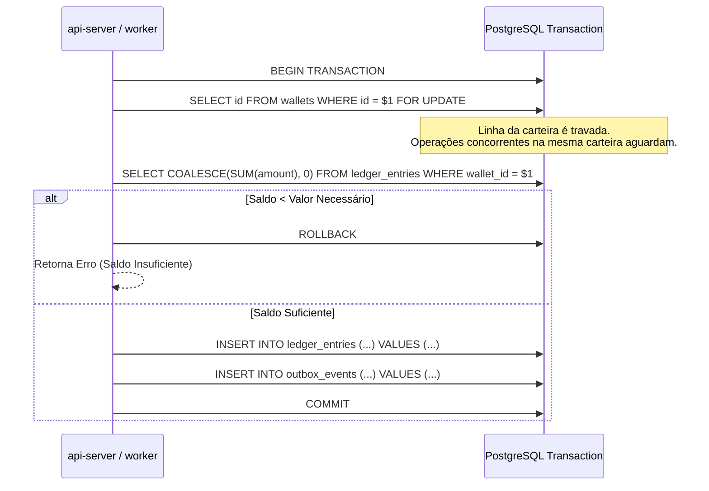

# Arquitetura do Ledger Contábil

O módulo contábil do **BitcoSats** (`crates/domain/src/ledger/` e `crates/db/src/ledger/`) é o núcleo financeiro de toda a plataforma. Ele implementa um razão de partidas imutáveis (*append-only ledger*) para todas as moedas suportadas (**BTC, LTC, DOGE, BCH e POL**).

---

## 1. Princípios Contábeis Fundamentais

1. **Sem Coluna de Saldo**: Nenhuma tabela (`users`, `wallets`, `accounts`) possui campo de saldo mutável.
2. **Cálculo Determinístico**: O saldo de qualquer carteira é dado por:
   $$\text{Saldo}(\text{wallet\_id}) = \sum_{e \in \text{ledger\_entries}} e.\text{amount}$$
3. **Imutabilidade**: Registros em `ledger_entries` nunca são atualizados (`UPDATE`) nem excluídos (`DELETE`).
4. **Precisão Absoluta**: Todos os valores são expressos na menor fração indivisível da moeda (Sats para BTC/BCH, Litoshis para LTC, Koinus para DOGE, Wei para POL) utilizando o tipo `numeric(39, 0)` no PostgreSQL e `BigDecimal` ou `i128` no Rust.

---

## 2. Tipos de Lançamento (`ledger_type`)

| Tipo | Natureza | Descrição |
|---|---|---|
| `DEPOSIT` | Crédito (+) | Depósito on-chain ou Lightning confirmado e creditado na carteira |
| `DEPOSIT_REVERSAL` | Débito (-) | Reversão de depósito decorrente de reorganização profunda de blocos (*reorg*) |
| `WITHDRAWAL` | Débito (-) | Saque solicitado pelo usuário |
| `WITHDRAWAL_FEE` | Débito (-) | Taxa de rede estimada/paga no saque |
| `WITHDRAWAL_REVERSAL` | Crédito (+) | Estorno de saque cancelado ou falho na rede |
| `FAUCET` | Crédito (+) | Resgate de recompensa do faucet |
| `TRANSFER_IN` | Crédito (+) | Transferência interna recebida de outro usuário ou API pública |
| `TRANSFER_OUT` | Débito (-) | Transferência interna enviada para outro usuário |
| `SWAP_IN` | Crédito (+) | Moeda de destino recebida em uma operação de câmbio |
| `SWAP_OUT` | Débito (-) | Moeda de origem debitada em uma operação de câmbio |
| `SWAP_FEE` | Débito (-) | Taxa de corretagem cobrada na operação de câmbio |
| `STAKE_LOCK` | Débito (-) | Bloqueio de principal em contrato de rendimento (staking) |
| `STAKE_UNLOCK` | Crédito (+) | Devolução do principal bloqueado no vencimento ou cancelamento |
| `STAKE_REWARD` | Crédito (+) | Rendimento gerado pelo contrato de staking |
| `LEND_SUPPLY` | Débito (-) | Depósito de liquidez no pool de empréstimos |
| `LEND_WITHDRAW` | Crédito (+) | Retirada de liquidez do pool de empréstimos |
| `LEND_BORROW` | Crédito (+) | Empréstimo tomado contra colateral |
| `LEND_REPAY` | Débito (-) | Quitação de dívida de empréstimo |
| `LEND_INTEREST` | Débito (-) | Juros acumulados sobre a posição devedora |
| `LIQUIDATION` | Débito/Crédito | Liquidação forçada de colateral por violação de LTV |
| `REWARD` | Crédito (+) | Recompensa de programas de incentivo de liquidez |
| `ADJUSTMENT` | Ajuste (+/-) | Ajuste administrativo auditado |

---

## 3. Modelo de Concorrência e Locks

Para garantir que duas requisições simultâneas não causem saldo negativo (*double-spend race condition*), todo fluxo financeiro segue a seguinte sequência obrigatória:

> **Por que travar a linha da carteira em vez do agregado?**
> Conforme documentado no [ADR 0006](file:///home/gustavo/Documentos/BitcoSats/current/docs/decisions/0006-lock-wallet-row-not-ledger-aggregate.md), uma carteira recém-criada não possui linhas na tabela `ledger_entries`. Um `SELECT ... FOR UPDATE` sobre o agregado de `ledger_entries` retornaria 0 linhas para travar, permitindo que transações simultâneas passassem sem serialização. Travar a linha da tabela `wallets` garante que o lock sempre ocorra.

---

## 4. Carteiras de Sistema (`wallet_kind`)

Além das carteiras de usuários comuns (`PERSONAL` e `DEVELOPER`), o sistema mantém carteiras corporativas gerenciadas internamente:

1. **`HOUSE`**: Carteira de tesouraria da plataforma. Responsável por pagar os resgates do faucet, receber taxas de swap/saques e pagar rendimentos de staking.
2. **`LEND_POOL`**: Carteira que concentra os fundos do mercado de empréstimos descentralizado.

Toda operação de swap ou faucet é um lançamento balanceado entre a carteira do usuário e a carteira `HOUSE`.
