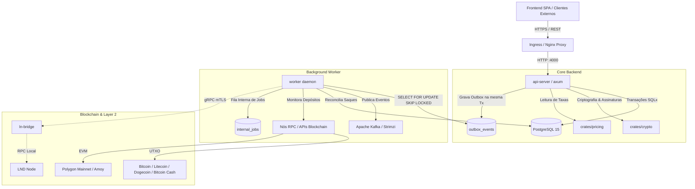

# Visão Geral da Arquitetura

O **BitcoSats** é uma plataforma financeira de custódia e serviços de criptoativos (suportando **BTC, LTC, DOGE, BCH e POL**), projetada com foco em integridade contábil estrita, alta concorrência e isolamento de componentes.

---

## 1. Topologia do Workspace Cargo

```text
current/
├── crates/
│   ├── shared/       # Tipos puros, moedas, precisão e matemática financeira (sem I/O)
│   ├── domain/       # Entidades e interfaces centrais (AuthRepo, LedgerRepo)
│   ├── db/           # SQLx, schema, migrations e orquestração transacional no Postgres
│   ├── crypto/       # AES-256-GCM, Argon2id, JWT HS256 e HMAC-SHA256
│   ├── chain/        # Clientes de blockchain (RPC Bitcore/Polygon, UTXO/EVM e stubs)
│   ├── events/       # Eventos de domínio, outbox writer e produtor/consumidor Kafka
│   ├── queue/        # Fila interna de tarefas persistente (Postgres SKIP LOCKED)
│   ├── notify/       # Serviço de envio de e-mails transacionais (SMTP)
│   ├── captcha/      # Integração com Cloudflare Turnstile e cache anti-replay
│   ├── pricing/      # Atualização e cache de taxas de câmbio (CoinGecko)
│   ├── api-http/     # Camada web Axum (controllers, rotas e middlewares de segurança)
│   ├── worker/       # Binário worker (reconciliação, depósitos, outbox relay e crons)
│   └── api-server/   # Binário do servidor HTTP principal
├── client/           # Frontend SPA (React 18, TypeScript, TailwindCSS, Vite)
├── deploy/           # Manifests Kubernetes (CloudNativePG, Strimzi) e Docker Compose
├── docs/             # Documentação técnica de ponta a ponta
└── storage/          # Armazenamento local de imagens, backups, temporários e logs
```

---

## 2. Diagrama Arquitetural de Alto Nível



---

## 3. Princípios Fundamentais de Design

### 3.1 Integridade Contábil (Zero Balance Column)
O sistema opera como um razão contábil de partidas dobradas puro. Nenhuma tabela possui coluna de saldo acumulado. O saldo de qualquer carteira é derivado em tempo de execução através da soma dos lançamentos da tabela `ledger_entries`.
A concorrência é estritamente serializada através do lock na linha da tabela `wallets` (`SELECT id FROM wallets WHERE id = $1 FOR UPDATE`).

### 3.2 Transactional Outbox Pattern
Nenhuma alteração de estado publica diretamente no barramento de eventos antes do commit do banco. Ao executar uma operação no ledger, o evento correspondente é persistido na tabela `outbox_events` na mesma transação atômica. O processo `outbox_relay` do `worker` lê eventos pendentes e publica no Kafka com semântica *at-least-once*.

### 3.3 Fila Interna em PostgreSQL
Tarefas determinísticas internas (ex: broadcast e reconciliação de saques) utilizam a tabela `internal_jobs` com o mecanismo `SELECT ... FOR UPDATE SKIP LOCKED`. Isso elimina dependência de Redis/BullMQ e garante que o estado da fila compartilhe a mesma consistência transacional do banco principal.

### 3.4 Isolamento de Custódia e Menor Privilégio
- Chaves privadas quentes de blockchain permanecem isoladas no daemon do worker ou sob HSM/chaves de assinatura dedicadas.
- Na integração Lightning (veja `docs/architecture/lightning.md`), a comunicação com o nó LND é mediada pelo microserviço `ln-bridge` através de certificados mTLS com permissões restritas (`invoicer` para o servidor web e `payer` para o worker).
