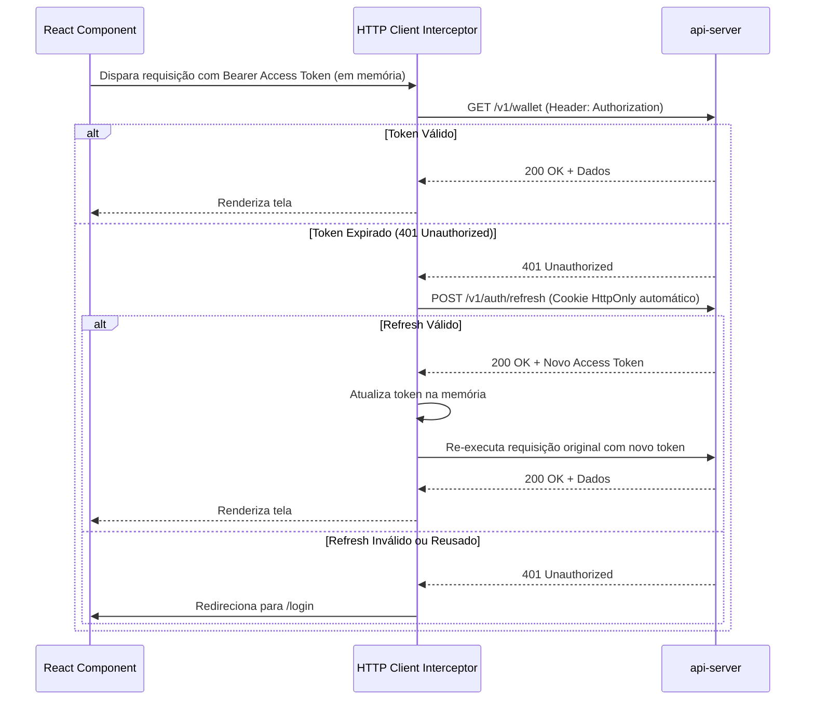

# Arquitetura do Frontend (`client`)

O frontend do **BitcoSats** (`current/client/`) é uma Single Page Application (SPA) moderna, rápida e responsiva construída com **React 18**, **TypeScript**, **Vite** e **TailwindCSS**.

---

## 1. Estrutura de Diretórios

```text
client/src/
├── App.tsx             # Roteamento principal e provedores de contexto
├── main.tsx            # Ponto de entrada da aplicação
├── components/         # Componentes reutilizáveis (Layout, UI, Modais, QR Code)
├── features/           # Módulos de domínio com lógica e componentes encapsulados
│   ├── auth/           # Formulários de Login, Registro e recuperação
│   ├── wallet/         # Listagem de carteiras, extrato do ledger e transferências
│   ├── deposits/       # Geração de endereços on-chain e QR codes
│   ├── withdrawals/    # Formulário de saque com validação e 2FA
│   ├── swap/           # Cotações em tempo real e interface de câmbio
│   ├── faucet/         # Resgate de faucet integrado com Turnstile
│   ├── stake/          # Painel de contratos de staking e resgate
│   ├── lend/           # Interface do mercado monetário (Supply, Borrow, Repay)
│   ├── merchant/       # Área do comerciante e ferramentas
│   └── admin/          # Painel administrativo de moderação e auditoria
├── hooks/              # Custom hooks (useAuth, useWallet, useInterval, etc.)
├── i18n/               # Internacionalização (suporte a múltiplos idiomas)
├── lib/                # Configuração do Axios/Fetch, utilitários e formatadores
├── shared/             # Definições de tipos e regras matemáticas compartilhadas
├── stores/             # Gerenciamento de estado global (Zustand)
└── styles/             # Configurações globais de CSS e tema
```

---

## 2. Gestão de Sessão e Autenticação

O cliente adota a melhor prática de segurança para gerenciamento de tokens JWT:



### 2.1 Princípios de Segurança no Cliente
- **Access Token em Memória**: O Access Token nunca é persistido em `localStorage` para mitigar roubo via ataques XSS.
- **Refresh Token em Cookie HttpOnly**: O Refresh Token trafega apenas em cookies com as flags `HttpOnly`, `Secure` e `SameSite=Strict`.

---

## 3. Build e Implantação

O frontend é compilado para arquivos estáticos (`HTML`, `JS`, `CSS`) e servido em produção através de uma imagem Nginx leve:

```bash
# Desenvolvimento local
npm run dev

# Build de produção
npm run build

# Dockerfile de produção (client/Dockerfile)
docker build -t bitcosats/client:latest client/
```
