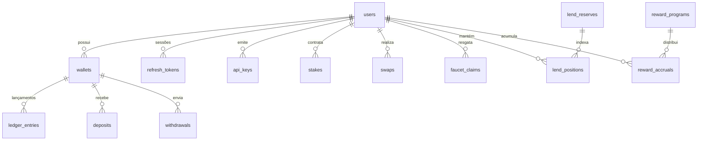

# Esquema do Banco de Dados e Modelos

O banco de dados do **BitcoSats** é o **PostgreSQL 15+** com migrações gerenciadas via **SQLx** (`crates/db/migrations/`).

---

## 1. Diagrama Entidade-Relacionamento (ERD) Simplificado

---

## 2. Dicionário de Tabelas Principais

### `users`
Contas de usuários, credenciais, status 2FA e perfil de comerciante.
- `id` (uuid, PK)
- `email` (text, Unique)
- `username` (text, Unique)
- `password_hash` (text, Argon2id)
- `role` (`user_role`: `'USER'`, `'ADMIN'`)
- `totp_secret_enc` (text, Segredo TOTP criptografado com AES-256-GCM)
- `two_factor_enabled` (boolean)
- `merchant_status` (`merchant_status`: `'NONE'`, `'PENDING'`, `'APPROVED'`, `'REJECTED'`)

### `wallets`
Carteiras de usuários e contas corporativas da plataforma.
- `id` (uuid, PK)
- `user_id` (uuid, FK -> users.id)
- `coin` (`coin`: `'BTC'`, `'LTC'`, `'DOGE'`, `'BCH'`, `'POL'`)
- `kind` (`wallet_kind`: `'PERSONAL'`, `'DEVELOPER'`, `'HOUSE'`, `'LEND_POOL'`)
- `address` (text, Unique - Endereço on-chain determinístico)
- `hd_index` (bigint - Índice de derivação sequencial BIP32)
- `reorg_hold_at` (timestamptz - Trava de segurança para reorg de blocos)

### `ledger_entries`
O razão contábil imutável (*append-only*).
- `id` (uuid, PK)
- `wallet_id` (uuid, FK -> wallets.id)
- `amount` (numeric(39, 0) - Valor positivo para crédito, negativo para débito)
- `type` (`ledger_type`: `'DEPOSIT'`, `'WITHDRAWAL'`, `'SWAP_IN'`, `'SWAP_OUT'`, etc.)
- `reference_id` (uuid - ID do recurso originador, ex: saque, swap, stake)
- `reference_type` (text - Nome da entidade de referência, ex: `'withdrawal'`, `'swap'`)
- `reference_key` (text - Chave textual para referências compostas)
- `memo` (text)
- `created_at` (timestamptz)

### `deposits`
Rastreamento de transações de entrada nas blockchains.
- `id` (uuid, PK)
- `wallet_id` (uuid, FK -> wallets.id)
- `tx_hash` (text)
- `vout` (int)
- `amount` (numeric(39, 0))
- `confirmations` (int)
- `status` (`deposit_status`: `'PENDING'`, `'CONFIRMED'`, `'CREDITED'`, `'ORPHANED'`)

### `withdrawals`
Saques solicitados, máquina de estados e reconciliação.
- `id` (uuid, PK)
- `wallet_id` (uuid, FK -> wallets.id)
- `to_address` (text)
- `amount` (numeric(39, 0))
- `fee_amount` (numeric(39, 0))
- `status` (`withdrawal_status`: `'PENDING'`, `'APPROVED'`, `'QUEUED'`, `'BROADCASTING'`, `'BROADCASTED'`, `'CONFIRMED'`, `'FAILED'`, `'CANCELED'`)
- `tx_hash` (text)
- `idempotency_key` (text, Unique)

### `swaps`
Histórico de operações de câmbio instantâneo entre moedas.
- `id` (uuid, PK)
- `user_id` (uuid, FK -> users.id)
- `from_coin`, `to_coin` (`coin`)
- `from_amount`, `to_amount`, `fee_amount` (numeric(39, 0))
- `price_from`, `price_to` (numeric(39, 0))
- `idempotency_key` (text, Unique)

### `lend_reserves` e `lend_positions`
Mecanismo de mercado monetário e empréstimos baseado em índices cumulativos (estilo Aave).
- `liquidity_index`, `borrow_index` (numeric(39, 0) com precisão Ray 1e18)
- `total_scaled_supply`, `total_scaled_debt` (numeric(39, 0))

### `outbox_events` e `internal_jobs`
Infraestrutura de mensageria assíncrona e fila de tarefas interna.
