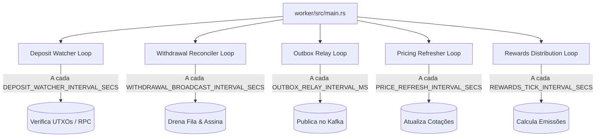

# Processamento em Segundo Plano e Daemon Worker

O binário `worker` (`crates/worker/`) é um serviço autônomo e assíncrono que executa tarefas essenciais para o funcionamento da plataforma sem bloquear as respostas da API HTTP.

---

## 1. Topologia de Tarefas Concorrentes

Ao iniciar, o `worker` inicializa um runtime Tokio e despacha cinco tarefas concorrentes em loops assíncronos:

---

## 2. Detalhamento dos Jobs

### 2.1 Monitor de Depósitos (`deposit_watcher`)
- **Intervalo padrão**: 10 segundos (`DEPOSIT_WATCHER_INTERVAL_SECS`).
- **O que faz**: Consulta nós RPC e APIs de blockchain procurando por transações destinadas aos endereços de depósito cadastrados em `wallets`.
- **Regra**: Detecta transações pendentes (`PENDING`), atualiza confirmações e, ao atingir o número mínimo exigido, credita a carteira no ledger e marca como `CREDITED`.

### 2.2 Reconciliador de Saques (`withdrawal_reconciler`)
- **Intervalo padrão**: 5 segundos (`WITHDRAWAL_BROADCAST_INTERVAL_SECS`).
- **O que faz**:
  1. `drain_broadcast_queue`: Seleciona saques com status `QUEUED` via `SELECT ... FOR UPDATE SKIP LOCKED`, assina a transação com a hot wallet e faz o broadcast na rede blockchain.
  2. `requeue_eligible`: Re-enfileira saques aprovados que ficaram sem execução.

### 2.3 Retransmissor de Eventos (`outbox_relay`)
- **Intervalo padrão**: 500 milissegundos (`OUTBOX_RELAY_INTERVAL_MS`).
- **O que faz**: Varre a tabela `outbox_events` em lotes (`OUTBOX_RELAY_BATCH_SIZE`), publica as mensagens no cluster Kafka e marca `published_at = now()`.

### 2.4 Atualizador de Cotações (`pricing_refresher`)
- **Intervalo padrão**: 60 segundos (`PRICE_REFRESH_INTERVAL_SECS`).
- **O que faz**: Consulta a API CoinGecko para obter os preços correntes de BTC, LTC, DOGE, BCH e POL em USD, gravando no banco com timestamp.

### 2.5 Distribuidor de Recompensas (`rewards_distributor`)
- **Intervalo padrão**: 60 segundos (`REWARDS_TICK_INTERVAL_SECS`).
- **O que faz**: Calcula o rateio contínuo das emissões de mineração de liquidez para usuários que fornecem liquidez no mercado de empréstimos.
